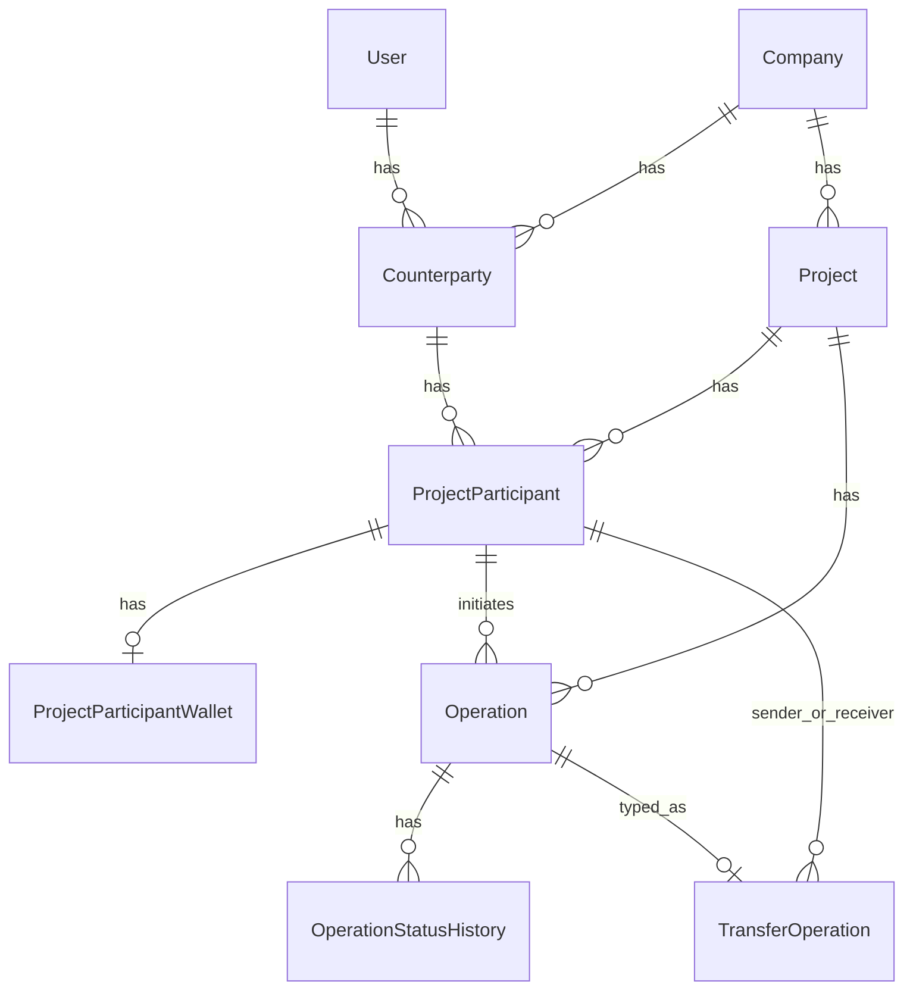

# GURU — архитектура, реализованный функционал и стандарты разработки

**Быстрый handoff одним файлом (прикреплять в новый чат):** корень репозитория — **`PROJECT_CONTEXT_GURU.md`**. В нём сводно: воркспейсы, домен переводов, полные таблицы маршрутов, пути к коду, Flutter, команды и типичные сбои. Этот документ — расширенная справка по модулям, стандартам и диаграммам.

Документ описывает текущее состояние монорепозитория **GuruApp**: доменную модель, разбиение на backend (Laravel) и мобильный клиент (Flutter), связи сущностей, уже реализованные модули и договорённости по разработке, зафиксированные в проекте и в технических заданиях (TZ).

---

## 1. Цель продукта и домен (high level)

**GURU** — платформа для совместной работы вокруг **компаний** и **проектов** с разделением контекстов **Company workspace** и **Personal workspace**, учётом **контрагентов**, **участников проекта**, **кошельков** на уровне участника и **операций** (в т.ч. **переводов**) с формализованным жизненным циклом статусов.

Ключевые принципы домена:

- **Кошелёк привязан к участнику проекта (`ProjectParticipant`)**, а не напрямую к пользователю, компании или контрагенту.
- **Логика Company и Personal workspace не смешивается**: разные префиксы маршрутов, разные middleware и сценарии доступа.
- **Деньги и суммы** — типы с фиксированной точностью (`decimal(15,2)` в БД, в PHP — касты `decimal:2` / строки; на backend для пересчёта переводов используется целочисленная арифметика в центах там, где это применимо).

---

## 2. Технологический стек

| Слой | Технологии |
|------|------------|
| Backend | PHP 8.3, Laravel 13, Laravel Sanctum, PostgreSQL |
| Backend (доп.) | Пакет `bavix/laravel-wallet` подключён в `composer.json` (есть исторические миграции кошельков/транзакций); **доменные балансы GURU для участников** живут в отдельной таблице `project_participant_wallets` |
| Mobile | Flutter, Riverpod, go_router, Dio |
| API | JSON, единый контракт ответов (см. §4) |

---

## 3. Структура репозитория

```
GuruApp/
├── backend/                 # Laravel API
│   ├── app/
│   │   ├── Models/          # User и при необходимости общие модели
│   │   ├── Modules/         # Фиче-модули домена (см. §5)
│   │   └── Support/         # Http helpers (ApiResponse, Pagination, middleware)
│   ├── database/migrations/
│   └── routes/api.php
├── mobile_app/              # Flutter-клиент
│   └── lib/
│       ├── core/            # API-клиент, тема, роутинг, общие виджеты
│       └── features/        # auth, workspaces, company_workspace, personal_workspace, customer_workspace, operations, …
└── docs/                    # Документация (этот файл)
```

---

## 4. HTTP API: контракт и инфраструктура

### 4.1. Успешный ответ

Используется обёртка `App\Support\Http\ApiResponse`:

- Поля: `ok: true`, `data` (объект или массив), `meta` (объект).
- В `meta` минимум **`request_id`**: берётся из заголовка `X-Request-Id` запроса, либо проставляется на стороне сервера.

### 4.2. Ошибки

Для `api/*` (и JSON-ожиданий) в `bootstrap/app.php` настроен единый рендер исключений:

- Структура: `ok: false`, `error` (`message`, `type`, при валидации — `fields`), `meta.request_id`.
- Отдельно маппится `InvalidOperationTransitionException` → HTTP **422**.

### 4.3. Идентификатор запроса и жёсткий JSON-контур

Middleware `App\Support\Http\Middleware\RequestId`:

- Принимает или генерирует `X-Request-Id`, прокидывает в ответ.
- Все успешные ответы через `ApiResponse::ok()` также кладут `request_id` в `meta`.

На API-группе `api/*` (см. `bootstrap/app.php`, `$middleware->api(append: ...)`) подключены:

- `ForceJsonResponse` — единый контракт тела ответа.
- `RequestId` — `X-Request-Id` / `meta.request_id`.
- `RejectHtmlApiResponses` — если по сниффингу тела ответ под `api/*` похож на HTML (логин, страница ошибки веб-сервера), подмена на JSON-ошибку **502** (`api_error.html_response`), чтобы мобильный клиент не падал на парсинге «как JSON».

В `bootstrap/app.php` для рендера исключений API-ветка определяется по **`$request->is('api/*')`**, чтобы глобальные обработчики не отдавали редирект/HTML там, где клиент ждёт JSON.

В `AppServiceProvider` вызывается **`JsonResource::withoutWrapping()`**: поля из `JsonResource` попадают в `data` ответа **без** дополнительной обёртки Laravel `data: { ... }` на уровне Resource (итоговая форма — одна обёртка `ApiResponse`).

### 4.4. Пагинация

Класс `App\Support\Http\Pagination\Pagination`:

- Query-параметры: `page`, `per_page`.
- По умолчанию **`per_page = 20`**, максимум **`50`**.

Формат тела внутри `data` для списков (через `PaginatedResourceResponse::fromPaginator`):

```json
{
  "items": [ … ],
  "pagination": {
    "page": 1,
    "per_page": 20,
    "total": 100,
    "last_page": 5
  }
}
```

На Flutter парсятся модели `Paginated<T>` и `PaginationInfo` в `mobile_app/lib/core/api/api_models.dart`.

---

## 5. Backend: модульная архитектура

Модули располагаются в `backend/app/Modules/<Name>/` по слоям:

- `Enums/` — перечисления домена (роли, типы операций, статусы, тип цели перевода).
- `Models/` — Eloquent-модели модуля.
- `Services/` — бизнес-логика, транзакции, оркестрация.
- `Http/Controllers/` — «тонкие» контроллеры: валидация через FormRequest, вызов сервиса, `ApiResponse` + Resource.
- `Http/Requests/` — FormRequest.
- `Http/Resources/` — JSON-представления (DTO наружу).
- `Exceptions/` — доменные исключения.

**Стандарты (как договорённости в проекте):**

- Не отдавать «сырой» Eloquent наружу — использовать **Resources**.
- Не раздувать контроллеры — **Services** и отдельные классы для переходов статусов и финансовой математики.
- Многошаговые изменения БД — **`DB::transaction`** в сервисах.
- **Операции типа TRANSFER:** создание и начальные статусы — в **`TransferService::create`**; все последующие переходы и откаты кошельков — только через **`TransferLifecycleService`** и соответствующие HTTP-эндпоинты; аудит в `operation_status_histories` (в т.ч. `comment`, `author_user_id`, `author_full_name`).
- **`OperationTransitionService`** — централизованная карта переходов для **прочих** типов операций (INCOME/REPORT и т.д., когда появятся); для TRANSFER по коду не вызывается.

---

## 6. Маршрутизация API (актуальный снимок)

Файл `backend/routes/api.php`.

### 6.1. Публичные / общие

| Метод | Путь | Назначение |
|-------|------|------------|
| GET | `/api/health` | Проверка живости |
| POST | `/api/auth/register` | Регистрация |
| POST | `/api/auth/token` | Выдача токена |
| GET | `/api/auth/me` | Текущий пользователь (Sanctum) |
| POST | `/api/auth/logout` | Выход (Sanctum) |

### 6.2. Защищённые Sanctum

| Метод | Путь | Назначение |
|-------|------|------------|
| GET | `/api/workspaces` | Список доступных воркспейсов |

### 6.3. Company workspace

Префикс: `/api/company-workspace/{companyId}`  
Middleware: `EnsureCompanyWorkspaceAccess` — доступ есть у **активного** контрагента компании с ролью **OWNER** или **PARTNER**, привязанного к текущему `user_id`.

| Метод | Путь | Назначение |
|-------|------|------------|
| GET | `/context` | Контекст воркспейса |
| GET | `/operations/transfers/history` | Агрегированная лента переводов по всем проектам с видимостью для пользователя в компании |
| GET | `/operations/transfers/pending-count` | `{ pending_action_count }` — переводы, где от пользователя ожидается шаг подтверждения (whitelist действий, см. `TransferPendingActionCountService`) |
| GET | `/companies/current` | Текущая компания |
| GET/POST | `/projects` | Список / создание проекта |
| GET | `/projects/{projectId}/participants` | Участники (пагинация) |
| POST | `/projects/{projectId}/participants` | Добавить участника |
| PATCH | `/projects/{projectId}/participants/{participantId}` | Смена роли |
| DELETE | `/projects/{projectId}/participants/{participantId}` | Удаление участника |
| GET | `/projects/{projectId}/participants/{participantId}/wallet` | Балансы кошелька участника |
| GET/POST | `/counterparties` | Список / создание контрагента |
| GET | `/projects/{projectId}/operations/transfers/recipients` | Список допустимых получателей по типу (`transfer_target_type` в query) |
| GET | `/projects/{projectId}/operations/transfers` | Список переводов |
| POST | `/projects/{projectId}/operations/transfers` | Создать перевод |
| GET | `/projects/{projectId}/operations/transfers/{transferId}` | Деталь перевода: в `data.transfer` — история статусов, при загрузке проекта — `project_name`; в `data.available_actions` — карта разрешённых POST-действий для UI |
| POST | `/projects/{projectId}/operations/transfers/{transferId}/approve-project-head` | Утвердить (сотрудн. сценарий): дельты → `WAITING_24_HOURS`, старт 24 ч UTC |
| POST | `/projects/{projectId}/operations/transfers/{transferId}/reject-project-head` | Отклонить на согласовании РП (с промежуточным `REJECTED` и возвратом в `CREATED`) |
| POST | `/projects/{projectId}/operations/transfers/{transferId}/reset-approval` | Сотрудник: сброс из `PROJECT_HEAD_APPROVAL` в `CREATED` |
| POST | `/projects/{projectId}/operations/transfers/{transferId}/submit-for-approval` | Сотрудник: `CREATED` → `PROJECT_HEAD_APPROVAL` |
| POST | `/projects/{projectId}/operations/transfers/{transferId}/complete-immediate` | РП/партнёр: `CREATED` → `COMPLETED` с применением дельт (при создании HEAD/PARTNER обычно уже `COMPLETED`) |
| POST | `/projects/{projectId}/operations/transfers/{transferId}/return-to-created` | Сотрудник: из `WAITING_24_HOURS` откат дельт → `CREATED` |
| POST | `/projects/{projectId}/operations/transfers/{transferId}/return-to-project-head-approval` | РП: из `WAITING_24_HOURS` откат дельт → `PROJECT_HEAD_APPROVAL` |
| POST | `/projects/{projectId}/operations/transfers/{transferId}/complete-waiting` | РП: `WAITING_24_HOURS` → `COMPLETED` (дельты уже применены) |
| POST | `/projects/{projectId}/operations/transfers/{transferId}/rollback-completed` | Откат `COMPLETED` для сценария РП/партнёра (дельты снимаются) |
| POST | `/projects/{projectId}/operations/transfers/{transferId}/return-completed-to-project-head-approval` | РП: из `COMPLETED` сценария сотрудника откат дельт → `PROJECT_HEAD_APPROVAL` |

Планировщик Laravel: команда **`operations:complete-expired-transfer-waiting`** (раз в минуту в `bootstrap/app.php`) — авто-перевод в `COMPLETED`, если с `waiting_period_started_at` в UTC прошло ≥ 24 ч.

### 6.4. Personal workspace

Префикс: `/api/personal-workspace`  
Middleware: `EnsurePersonalWorkspaceAccess` — пользователь с активным контрагентом в роли **EMPLOYEE / CONTRACTOR / SUPPLIER / CUSTOMER**.

| Метод | Путь | Назначение |
|-------|------|------------|
| GET | `/context` | Контекст |
| GET | `/operations/transfers/history` | Лента переводов по всем проектам с участием пользователя (видимость как в company-контуре на проект) |
| GET | `/operations/transfers/pending-count` | То же правило счётчика «ожидают подтверждения», что и в company-workspace |
| GET | `/companies` | Компании пользователя (в личном кабинете) |
| GET | `/projects` | Проекты пользователя (в ресурсе — `my_wallet`, **`my_participation`** с `level` и `project_role_code` для клиента) |
| GET | `/income-by-month` | Доход по месяцам (исполнительский контур) |

**Переводы (ТЗ-05.3):** те же доменные сервисы, что и в company-workspace (`TransferService`, `TransferRecipientListService`, `OperationVisibilityService`, `TransferLifecycleService`, **`TransferAvailableActionsService`**, **`TransferPendingActionCountService`**). Отличается префикс маршрута и проверка инициатора: **`PersonalWorkspaceTransferGuard`** — создание перевода, выдача списка получателей для формы и действия сотрудника (`submit-for-approval`, `reset-approval`, `return-to-created`) разрешены только если участник проекта **уровня `first`** и **роль в проекте `EMPLOYEE`**; иначе **403**. Поставщик, подрядчик, 2-й уровень и заказчик не создают переводы через этот контур (видимость списков переводов — по `OperationVisibilityService`: не РП видит только операции, где он initiator/sender/receiver).

| Метод | Путь | Назначение |
|-------|------|------------|
| GET | `/projects/{projectId}/operations/transfers/recipients` | Получатели (`transfer_target_type` в query); для инициатора из личного кабинета — после guard |
| GET | `/projects/{projectId}/operations/transfers` | Список переводов проекта (с фильтром видимости) |
| POST | `/projects/{projectId}/operations/transfers` | Создать перевод |
| GET | `/projects/{projectId}/operations/transfers/{transferId}` | Деталь перевода |
| POST | `/projects/{projectId}/operations/transfers/{transferId}/submit-for-approval` | Сотрудник: отправка на согласование РП |
| POST | `/projects/{projectId}/operations/transfers/{transferId}/reset-approval` | Сотрудник: сброс из `PROJECT_HEAD_APPROVAL` |
| POST | `/projects/{projectId}/operations/transfers/{transferId}/return-to-created` | Сотрудник: откат из `WAITING_24_HOURS` → `CREATED` |

Действия **только для РП/партнёра** остаются в **§6.3** (company-workspace). Доступ к проекту в personal-контуре: **`ProjectVisibilityService::assertCanAccessPersonalWorkspaceProject`**.

Подробное ТЗ: `docs/TZ_05_3_GURU_Transfer_Personal_Workspace_Alignment.md`.

---

## 7. Доменная модель и связи

Ниже — сущности, которые уже используются в коде и БД (миграции в `backend/database/migrations/`).

### 7.1. Словари ролей

- **Компания**: `CompanyRoleCode` — OWNER, PARTNER, EMPLOYEE, CONTRACTOR, SUPPLIER, CUSTOMER (и др. по мере расширения словаря).
- **Проект**: `ProjectRoleCode` — PROJECT_HEAD, CUSTOMER, PARTNER, SUPERVISOR, EMPLOYEE, SUPPLIER, CONTRACTOR.

Роли хранятся в справочных таблицах (`dictionaries`), код — строковый FK в бизнес-таблицах.

### 7.2. Компания и контрагент

- **`companies`** — организация.
- **`counterparties`** — «лицо» в контексте компании: связь с `company_id`, опционально `user_id`, `company_role_code`, контактные поля (`full_name`, `email`), `is_active`.
- Контрагент может существовать без пользователя (сценарий invite-first).

Связи:

- `Counterparty` → `Company`, `User?`, `ProjectParticipant[]`.

### 7.3. Проект и участник

- **`projects`** — проект внутри компании.
- **`project_participants`** — участник проекта: `project_id`, `counterparty_id`, `project_role_code`, `level`, `is_active`.

Связи:

- `ProjectParticipant` → `Project`, `Counterparty`, `ProjectRole`, `ProjectParticipantWallet` (hasOne).

### 7.4. Кошелёк участника (`project_participant_wallets`)

Один кошелёк на участника. Поля балансов (все `decimal(15,2)`):

| Поле | Смысл в терминах TZ |
|------|---------------------|
| `personal_balance` | Личный баланс |
| `personal_earned` | Личный заработанный |
| `personal_received` | Личный полученный |
| `accountable_balance` | Подотчётный баланс |
| `accountable_received` | Подотчётный полученный |
| `accountable_spent` | Подотчётный потраченный |

Сервисы:

- `WalletFactoryService` — идемпотентное создание записи кошелька.
- `WalletBalanceService` / `WalletService` — чтение и единообразная выдача сумм (без потери точности через float).
- При создании проекта и при добавлении участника кошелёк обеспечивается (см. `CreateProjectController`, `ProjectParticipantService`).

### 7.5. Операции (база)

Таблица **`operations`**:

- `project_id`
- `initiator_project_participant_id`
- `operation_type` (`OperationType`: INCOME, TRANSFER, REPORT)
- `operation_status` (`OperationStatus`)

Таблица **`operation_status_histories`** — журнал переходов: `from_status`, `to_status`, `changed_by_project_participant_id`, опционально **`comment`**, **`author_user_id`**, **`author_full_name`**, `created_at`.

Для **TRANSFER** записи пишут **`TransferService`** и **`TransferLifecycleService`**. **`OperationTransitionService`** описывает карту для будущих типов операций и **не** участвует в смене статуса перевода.

Статусы (подмножество жизненного цикла GURU): CREATED, PROJECT_HEAD_APPROVAL, CUSTOMER_APPROVAL, WAITING_24_HOURS, COMPLETED, REJECTED, ROLLED_BACK.

**Терминальность:** метод enum **`isTerminal()`** сохраняет общий смысл (в т.ч. `REJECTED` — терминальный «в лоб»). Для бизнес-логики сервисов используется **`OperationStatus::isTerminalForOperationType(OperationType)`**: для **TRANSFER** переход с участием `REJECTED` не считается завершением операции (промежуточное отклонение с возвратом к редактированию); для будущих **INCOME**/**REPORT** — по умолчанию совпадает с `isTerminal()`, при необходимости расширяется. Кэш словаря статусов (`DictionaryCacheService`, ключ `guru:dict:operation_statuses:v2`) отдаёт и общий признак `terminal`, и карту **`is_terminal_by_operation_type`**.

### 7.6. Перевод (`transfer_operations`)

Таблица связывает операцию с деталями перевода:

- `operation_id`, `project_id`, `initiator_project_participant_id`
- `sender_project_participant_id`, `receiver_project_participant_id`
- **`receiver_counterparty_id`** (nullable) — для расчётного перевода: исходный контрагент-получатель до резолва во второго участника
- `transfer_target_type` — **`PERSONAL_BALANCE`** или **`ACCOUNTABLE_BALANCE`**
- `amount`, `comment?`, дублирование **`operation_status`** для удобства выборок (согласовано с базовой операцией)
- **`wallets_applied_at`**, **`wallets_reverted_at`**, **`waiting_period_started_at`** (UTC-семантика для 24 ч ожидания и аудита)

Сервисы:

- **`TransferBalanceService`** — математика дельт и **`revertTransfer`** (целочисленные центы при пересчёте).
- **`TransferParticipantResolver`** — допустимые получатели и автосоздание участника второго порядка для расчётного перевода.
- **`TransferService::create`** — создание `Operation` + `TransferOperation`: **PROJECT_HEAD / PARTNER** → сразу **`COMPLETED`** с применением дельт; **EMPLOYEE** → **`PROJECT_HEAD_APPROVAL`** без дельт.
- **`TransferLifecycleService`** — все действия после создания (согласование РП, 24 ч, завершение, откаты).
- **`TransferAvailableActionsService`** — карта **`available_actions`** для клиента (те же условия, что разрешают соответствующий POST).
- **`TransferPendingActionCountService`** — число переводов с «обязательным» входящим шагом для пользователя (whitelist **`PENDING_BADGE_ACTION_KEYS`**, без опциональных действий вроде `complete_immediate`).
- **`OperationVisibilityService::transferQueryForUserAcrossProjects`** — базовый запрос для агрегированной ленты переводов.
- **`TransferRecipientListService`** + `ListTransferRecipientsController` — список получателей для UI.

**ТЗ-05.2 v3 (сжато):** подотчётный перевод — получатели участники 1-го порядка (PROJECT_HEAD, PARTNER, EMPLOYEE); расчётный — контрагенты с автодобавлением 2-го уровня; 24 ч отсчитываются в UTC от `waiting_period_started_at`.

**ТЗ-05.3:** расчётный перевод (`PERSONAL_BALANCE`) — любой активный контрагент компании, включая роль **`CUSTOMER`**; маппинг company→project для 2-го порядка: `CUSTOMER` → `CUSTOMER` в проекте.

**Уточнения реализации (2026-05):** перевод **на подотчёт самому себе** запрещён; **на расчётный себе** — разрешён. В выдаче списка для подотчётного получателя **текущий участник исключается**. Для расчётного списка в кандидатах контрагентов допускаются роли **`OWNER`**, **`CUSTOMER`** и остальные из ТЗ-05.3. При автосоздании участника второго порядка для **OWNER** задано согласованное отображение роли в проекте (`TransferParticipantResolver`).

### 7.7. Диаграмма связей (обзор)



---

## 8. Производительность и качество API

Реализовано в духе TZ «Performance Foundation (1000 users)»:

- Миграция с **индексами** под частые фильтры/связи (составные и одиночные) — см. `2026_05_09_000004_add_performance_indexes_for_1000_users.php`.
- **Жадная загрузка** в контроллерах списков/show, где возможен N+1 (участники, переводы — по мере развития проверять `with(...)`).
- **`DictionaryCacheService`** — кэширование статичных словарей (роли, типы/статусы операций) для снижения нагрузки на БД.
- Пагинация списков с ограничением `per_page`.

---

## 9. Mobile app (Flutter)

### 9.1. Навигация

`go_router` в `mobile_app/lib/core/routing/router_provider.dart`:

- `/` Splash → `/login` | `/register` | `/workspaces`
- Экран `/workspaces`: кнопка **«Создать компанию»** видна **всегда** (в т.ч. при непустом списке)
- `/company/:companyId` → `CompanyWorkspaceShell`
- `/personal` → `PersonalWorkspaceShell` (нижняя навигация: главная исполнителя, **«Операции»** — `PersonalOperationsTab`, уведомления-заглушка)
- `/personal/companies` — полный список компаний личного кабинета
- `/customer`, `/customer/companies`, `/customer/companies/:companyId/projects` — кабинет заказчика (тот же personal-workspace API, фильтр ролей)
- `/create-company` — сценарий создания компании

Для экранов участников и переводов используются **императивные** `Navigator.push` с `MaterialPageRoute` (внутри company workspace и из personal «Операции»).

### 9.2. Слои фичи

Для каждой области:

- `domain/` — типизированные модели и enum’ы.
- `data/*_api.dart` — вызовы REST через `ApiClient`.
- `data/*_repository.dart` — фасад для UI/провайдеров.
- `providers.dart` — Riverpod.

Общие модели ответа: `ApiResponse`, `Paginated`, обработка ошибок — `ApiException` + `meta.request_id`.

`ApiClient` (Dio): **`ResponseType.plain`**, **`followRedirects: false`**, для мутаций — заголовок JSON, разбор тела с отловом HTML (сообщение пользователю вместо низкоуровневого `FormatException`). На Android для dev-HTTP — **`usesCleartextTraffic`** и разрешение **`INTERNET`** в манифесте.

### 9.3. UI и единый стиль

- Базовые виджеты: `AppScaffold`, `AppCard`, `AppInput`, `AppButton`, тема `guru_theme.dart`.
- **Company workspace** (`CompanyWorkspaceShell`): нижняя навигация — «Главная», уведомления (заглушка), **«Операции»** — агрегатор-плейсхолдер (`CompanyOperationsPlaceholderScreen`); живая работа с переводами — из **участников проекта** (иконка ⇄), bottom sheet «Операции» → проект, а также **главная компании**: плитка «История операций» → **`AggregatedTransfersHistoryScreen`** (`GET …/operations/transfers/history`), бейдж **`pending_action_count`** (`GET …/operations/transfers/pending-count`). По строке в **`TransfersScreen`** → **`TransferDetailScreen`**: таймлайн **`status_history`**, кнопки только при **`available_actions[key]`**; после успешного POST — **`Navigator.pushReplacement`** тем же `transferId` (стабильность виджетов); **`invalidate` счётчика** не вызывается с экрана детали во время действия — обновление при **`pop`** / refresh главной.
- **Personal workspace (исполнитель)** — вкладка **«Операции»** (`personal_operations_tab.dart`): пункт «Перевод» (только проекты, где `my_participation` = first + EMPLOYEE), список проектов → **`TransfersScreen`** / **`CreateTransferScreen`** с **`TransferApiScope.personal`**; «Отчёт» — disabled. Поставщик/подрядчик/2-й уровень: просмотр переводов без кнопки создания (`canCreateTransfer: false`).
- **Проекты** → **Участники** (`ProjectParticipantsScreen`):
  - карточка участника → **Кошелёк** (`ParticipantWalletScreen`);
  - иконка **⇄** → **Переводы** (`TransfersScreen`) → **создание** (`CreateTransferScreen`), переход в деталь перевода из списка.

### 9.4. Соответствие backend enum’ам

Flutter дублирует коды в:

- `features/operations/domain/operation_type.dart`
- `operation_status.dart`
- `transfer_target_type.dart`
- модели `TransferOperation`, `Operation`, `OperationStatusHistory`

При добавлении новых значений — синхронизировать PHP enum и Dart.

---

## 10. Что уже сделано (чеклист по модулям TZ)

| Модуль / тема | Состояние |
|---------------|-----------|
| Аутентификация Sanctum, профиль | Реализовано (register, token, me, logout) |
| Workspaces list + context | Реализовано |
| Company: создание, текущая компания | Реализовано |
| Counterparties в company workspace | Реализовано (листинг, создание, ресурс с контактами) |
| Projects: список, создание | Реализовано |
| Project participants (TZ-03C) | CRUD API, пагинация, роли, UI со списком/редактированием/удалением |
| Wallet foundation (TZ-04) | Таблица балансов, фабрика, API баланса, экран в приложении |
| Operation lifecycle foundation (TZ-05A) | operations + status history + transition service + исключение 422 |
| Performance foundation | Индексы, кэш словарей, стандарты пагинации |
| Transfer operation (ТЗ-05.2 v3) | Полный контур: lifecycle, recipients API, действия перевода, планировщик 24 ч UTC, **`available_actions`** и pending-count, агрегированная история; Flutter: список/создание/деталь/история по всем проектам |
| Вкладка «Операции» в нижнем меню (агрегатор) | **Пока плейсхолдер**; реальные переводы открываются из экрана участников проекта |

---

## 11. Стандарты разработки GURU (сводка)

1. **Два воркспейса** — не смешивать company- и personal-эндпойнты и бизнес-правила.
2. **Единый JSON-контракт** — `ok`, `data`, `meta.request_id`; ошибки — `ok: false`, `error`, `meta.request_id`.
3. **Типы денег** — decimal в БД; не использовать float для денежной логики.
4. **Контроллеры** — только координация; валидация в FormRequest; ответы через Resource и `ApiResponse`.
5. **Операции TRANSFER** — после создания только `TransferLifecycleService`; история в `operation_status_histories` (комментарий + автор). Для прочих типов операций — карта в `OperationTransitionService`.
6. **Переводы** — математика в `TransferBalanceService`; создание в `TransferService::create`; получатели — `TransferParticipantResolver` / API recipients.
7. **Пагинация** — `page`, `per_page`, `total`, `last_page`; default 20, max 50.
8. **Мобильный клиент** — repository + typed models; следовать визуальным паттернам `AppScaffold` и существующих экранов компании.
9. **Согласованность кодов** — строковые enum-коды в PHP и Dart должны совпадать.

---

## 12. Расширение документа

При добавлении новых модулей имеет смысл:

- дополнять §6 таблицей маршрутов;
- дополнять §7 сущностями и связями;
- фиксировать новые бизнес-инварианты в §11.

---

*Версия документа: 2026-05-09 (доп.: агрегированная история переводов, pending-count, экран детали во Flutter). Отражает кодовую базу GuruApp на указанную дату.*
