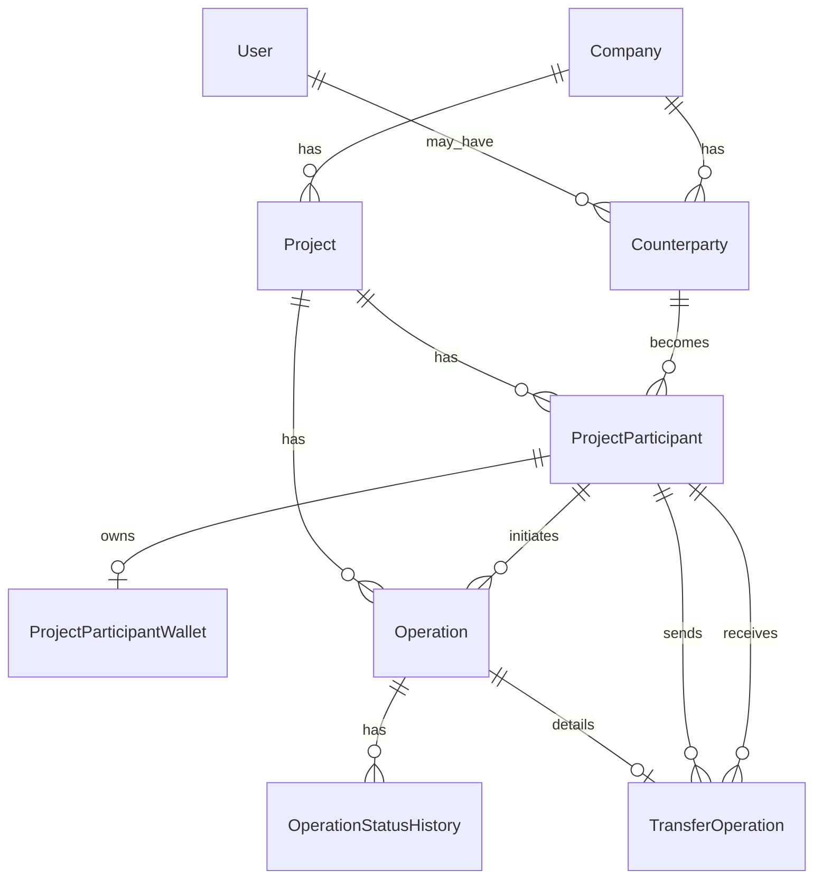

# GURU — полный архитектурный blueprint проекта

Версия документа: 2026-05-09 (операция **INCOME** (ТЗ-06): backend lifecycle, кошельки заказчика и РП, два планировщика в `bootstrap/app.php`; Flutter — создание и деталь поступления; **единая лента** истории TRANSFER+INCOME в клиенте и **объединённый pending-бейдж** — в долге); главный handoff — **`PROJECT_CONTEXT_GURU.md`**  
Репозиторий: `C:\GuruApp`  
Назначение: дать максимально подробное описание текущего проекта GURU, чтобы по этому документу можно было восстановить архитектуру, стандарты, основные модули, бизнес-инварианты и реализованное состояние приложения с нуля.

### Связка документов (чтобы не дублировать контекст в чате)

| Документ | Роль |
|----------|------|
| **`PROJECT_CONTEXT_GURU.md`** (корень репозитория) | **Главный** handout: воркспейсы, API, домен операций (**TRANSFER**, **INCOME**), пути к коду, Flutter, команды, сбои (всегда держите в актуальном виде) |
| **`docs/GURU_ARCHITECTURE_AND_STANDARDS.md`** | Расширенная справка: модули, §6 маршруты, диаграммы, чеклист, стандарты |
| **`docs/GURU_FULL_PROJECT_BLUEPRINT.md`** (этот файл) | Максимальная детализация, постулаты, UX кабинета заказчика, пошаговое «с нуля» |
| **`docs/GURU_TRANSFER_OPERATION_REFERENCE.md`** | Справочник по домену **TRANSFER** (математика, статусы, эндпойнты) |
| **`docs/GURU_INCOME_OPERATION_REFERENCE.md`** | Справочник по домену **INCOME** (ТЗ-06): сервисы, маршруты, кошельки |
| **`docs/TZ_05_3_GURU_Transfer_Personal_Workspace_Alignment.md`** | ТЗ выравнивания переводов и personal-workspace |

---

## 1. Что такое GURU

**GURU** — мобильная система для работы компаний, проектов, контрагентов, участников проектов, кошельков и финансовых операций. Сейчас приложение строится как связка:

- backend API на Laravel;
- мобильный клиент на Flutter;
- PostgreSQL как основная база данных;
- Laravel Sanctum для авторизации;
- Riverpod/go_router/Dio на мобильном клиенте.

Главная бизнес-идея: компания ведёт проекты, в проектах есть участники, у каждого участника проекта есть отдельный финансовый кошелёк. Операции не должны работать напрямую с пользователем или компанией, они должны работать через **ProjectParticipant**.

---

## 2. Главные постулаты проекта

Эти правила считаются архитектурными инвариантами. Их нельзя нарушать при дальнейшем развитии проекта.

### 2.1. Company Workspace и Personal Workspace не смешиваются

В системе есть два разных пользовательских контура:

1. **Company Workspace**
  - Для владельца/партнёра компании.
  - API-контур: `/api/company-workspace/{companyId}/...`
  - Доступ через `EnsureCompanyWorkspaceAccess`.
  - В текущей реализации доступ имеют активные контрагенты компании с ролью `OWNER` или `PARTNER`.
2. **Personal Workspace**
  - Для личной роли пользователя: сотрудник, подрядчик, поставщик, заказчик.
  - API-контур: `/api/personal-workspace/...`
  - Доступ через `EnsurePersonalWorkspaceAccess`.

**Кабинет заказчика (Flutter)** — отдельный UX-контур поверх того же API: пользователь с ролью `CUSTOMER` на контрагенте открывает `/customer`, данные берутся из personal-workspace с узким фильтром `workspace_role=customer` (см. п. 6.5 и 11.3). Это не новый backend-контур и не смешивается с company workspace.

Запрещено добавлять "универсальный" endpoint, который внутри сам решает, company это сценарий или personal. Контур должен быть явным на уровне маршрута, контроллера и middleware.

### 2.2. Кошелёк принадлежит участнику проекта

Кошелёк не принадлежит:

- пользователю;
- компании;
- контрагенту;
- проекту напрямую.

Кошелёк принадлежит только:

```text
ProjectParticipant -> ProjectParticipantWallet
```

Это ключевая модель GURU, потому что один и тот же пользователь/контрагент может иметь разные роли и балансы в разных проектах.

### 2.3. Деньги не считать через float/double

Для денег используются:

- в БД: `decimal(15,2)`;
- в Eloquent: `decimal:2`, фактически как строки;
- в сервисах расчёта: integer cents, если нужно выполнять арифметику.

Запрещено:

- использовать `float`;
- использовать `double`;
- выполнять финансовую математику во Flutter;
- выполнять финансовую математику в контроллерах;
- выполнять финансовую математику в Eloquent-моделях.

### 2.4. Финансовая математика должна быть изолирована

Для переводов единственное место финансовой математики:

```text
backend/app/Modules/Operations/Services/TransferBalanceService.php
```

Для поступлений (**INCOME**) — начисление на подотчёт заказчика и РП:

```text
backend/app/Modules/Operations/Services/IncomeBalanceService.php
```

Оркестрация создания операции перевода:

```text
backend/app/Modules/Operations/Services/TransferService.php
```

### 2.5. Операции имеют жизненный цикл

Любая операция должна иметь:

- базовую запись в `operations`;
- тип операции;
- статус операции;
- историю статусов в `operation_status_histories`.

Статусы нельзя менять произвольно. Для операций типа **TRANSFER** переходы после создания централизованы в **`TransferLifecycleService`** (создание и начальный статус — в **`TransferService::create`**). Для **INCOME** — в **`IncomeLifecycleService`** (создание — **`IncomeService`**). Карта в **`OperationTransitionService`** используется там, где подключена декларативно; **TRANSFER** и **INCOME** не меняют статус через этот сервис — только через свои lifecycle-сервисы.

```text
TransferLifecycleService   # TRANSFER после create
IncomeLifecycleService     # INCOME после create
```

### 2.6. API всегда отдаёт единый JSON-контракт

Успех:

```json
{
  "ok": true,
  "data": {},
  "meta": {
    "request_id": "..."
  }
}
```

Ошибка:

```json
{
  "ok": false,
  "error": {
    "message": "...",
    "type": "...",
    "fields": {}
  },
  "meta": {
    "request_id": "..."
  }
}
```

`request_id` обязателен и нужен для трассировки ошибок.

### 2.7. UI строится через общий дизайн-стандарт

Flutter-интерфейсы должны использовать:

- `AppScaffold`;
- `AppCard`;
- `AppButton`;
- `AppInput`;
- `AppLoader`;
- `AppEmptyState`;
- `AppSectionTitle`;
- токены темы: `AppColors`, `AppTextStyles`, `AppSpacing`, `AppRadii`.

Исключение по композиции: экран-оболочка **кабинета заказчика** (`CustomerWorkspaceShell`) использует `Scaffold` + **`SafeArea`** + нижний `NavigationBar`, без `AppScaffold`, чтобы корректно учесть статус-бар и home indicator; отступы и виджеты — те же токены (`AppSpacing`, `AppCard`, и т.д.).

Цветовой стиль:

- тёмная тема;
- единый accent `#00D6C9`;
- мягкие glass-like карточки;
- минималистичный fintech mobile style.

### 2.8. Русский язык основной

Приложение поддерживает RU/EN. Русский — язык по умолчанию.

UI-строки должны идти через Flutter localization:

```dart
context.l10n.someKey
```

Новые видимые строки нельзя хардкодить в widgets.

### 2.9. Backend является источником прав доступа

Flutter может скрывать лишние элементы, но защита данных всегда реализуется на backend.

Пользователь видит данные только через цепочку:

```text
User -> Counterparty -> ProjectParticipant -> Operation participation
```

Исключения:

- `OWNER` видит свою компанию и проекты своей компании;
- `PROJECT_HEAD` видит все операции своего проекта;
- company-level visibility для `OWNER` должна быть отдельным явно разрешённым правилом, а не неявным доступом к project operation endpoints.

Запрещены fallback-доступы:

- первая компания из БД;
- первый проект из БД;
- `company_id = 1`;
- `project_id = 1`;
- автоматический OWNER без Counterparty.

---

## 3. Стек и зависимости

### 3.1. Backend

Папка:

```text
backend/
```

Стек:

- PHP `^8.3`;
- Laravel `^13.7`;
- Laravel Sanctum `^4.0`;
- PostgreSQL;
- `bavix/laravel-wallet ^12.0` установлен как foundation-пакет, но доменные балансы GURU сейчас ведутся в отдельной таблице `project_participant_wallets`.

### 3.2. Mobile

Папка:

```text
mobile_app/
```

Стек:

- Flutter / Dart SDK `^3.11.5`;
- `flutter_riverpod`;
- `go_router`;
- `dio`;
- `flutter_secure_storage`;
- `logger`;
- `flutter_localizations`;
- `intl`;
- `shared_preferences`.

---

## 4. Структура репозитория

```text
C:\GuruApp
├── backend
│   ├── app
│   │   ├── Models
│   │   ├── Modules
│   │   │   ├── Auth
│   │   │   ├── Companies
│   │   │   ├── Dictionaries
│   │   │   ├── Operations
│   │   │   ├── Projects
│   │   │   ├── System
│   │   │   └── Workspaces
│   │   └── Support
│   ├── bootstrap
│   ├── config
│   ├── database
│   │   └── migrations
│   └── routes
│       └── api.php
├── mobile_app
│   ├── lib
│   │   ├── core
│   │   │   ├── api
│   │   │   ├── constants
│   │   │   ├── localization
│   │   │   ├── providers
│   │   │   ├── routing
│   │   │   ├── storage
│   │   │   ├── theme
│   │   │   └── widgets
│   │   ├── features
│   │   │   ├── auth
│   │   │   ├── company_workspace
│   │   │   ├── counterparties
│   │   │   ├── operations
│   │   │   ├── personal_workspace
│   │   │   ├── projects
│   │   │   └── workspaces
│   │   ├── l10n
│   │   └── main.dart
│   ├── l10n.yaml
│   └── pubspec.yaml
└── docs
```

---

## 5. Backend architecture

### 5.1. Feature-first modules

Backend организован по доменным модулям:

```text
backend/app/Modules/<ModuleName>
```

Внутри модуля используются слои:

```text
Enums/
Models/
Services/
Http/
  Controllers/
  Requests/
  Resources/
Exceptions/
```

Контроллеры должны быть тонкими. Их задачи:

- получить validated input из FormRequest;
- найти или подготовить модели;
- вызвать Service;
- вернуть `ApiResponse` + Resource.

Контроллер не должен:

- выполнять финансовую математику;
- содержать много бизнес-ветвлений;
- возвращать Eloquent напрямую;
- строить сложные DTO руками без Resource.

### 5.2. Support layer

Общие backend helper'ы находятся в:

```text
backend/app/Support
```

Ключевые элементы:

- `ApiResponse` — единый формат success-ответов;
- `RequestId` middleware — `X-Request-Id`;
- `ForceJsonResponse` middleware — принудительный JSON API;
- `Pagination` — нормализация `page`, `per_page`;
- `PaginatedResourceResponse` — единый формат списков.

### 5.3. Error handling

В `backend/bootstrap/app.php` настроен единый JSON renderer для API-ошибок.

Маппинг статусов:

- `AuthenticationException` -> `401`;
- `AuthorizationException` -> `403`;
- `ValidationException` -> `422`;
- `InvalidOperationTransitionException` -> `422`;
- `ModelNotFoundException` -> `404`;
- `HttpExceptionInterface` -> статус исключения;
- иначе -> `500`.

---

## 6. Backend routes

Файл:

```text
backend/routes/api.php
```

### 6.1. Public/system


| Method | Route         | Назначение   |
| ------ | ------------- | ------------ |
| GET    | `/api/health` | Health check |


### 6.2. Auth


| Method | Route                | Назначение               |
| ------ | -------------------- | ------------------------ |
| POST   | `/api/auth/register` | Регистрация              |
| POST   | `/api/auth/token`    | Получение токена         |
| GET    | `/api/auth/me`       | Текущий пользователь     |
| POST   | `/api/auth/logout`   | Удаление текущего токена |


### 6.3. Common authenticated


| Method | Route             | Назначение            |
| ------ | ----------------- | --------------------- |
| GET    | `/api/workspaces` | Доступные workspace'ы |


### 6.4. Company workspace

Entry route:


| Method | Route                              | Назначение                     |
| ------ | ---------------------------------- | ------------------------------ |
| POST   | `/api/company-workspace/companies` | Создать компанию и стать OWNER |


Scoped routes:


| Method | Route                                                                                         | Назначение                |
| ------ | --------------------------------------------------------------------------------------------- | ------------------------- |
| GET    | `/api/company-workspace/{companyId}/context`                                                  | Контекст компании         |
| GET    | `/api/company-workspace/{companyId}/operations/transfers/history`                             | Все видимые переводы по проектам компании (пагинация; при необходимости `project_name` в элементе) |
| GET    | `/api/company-workspace/{companyId}/operations/transfers/pending-count`                       | `{ pending_action_count }` — whitelist шагов подтверждения для пользователя |
| GET    | `/api/company-workspace/{companyId}/companies/current`                                        | Текущая компания          |
| GET    | `/api/company-workspace/{companyId}/projects`                                                 | Список проектов           |
| POST   | `/api/company-workspace/{companyId}/projects`                                                 | Создать проект            |
| GET    | `/api/company-workspace/{companyId}/counterparties`                                           | Список контрагентов       |
| POST   | `/api/company-workspace/{companyId}/counterparties`                                           | Создать контрагента       |
| GET    | `/api/company-workspace/{companyId}/projects/{projectId}/participants`                        | Список участников проекта |
| POST   | `/api/company-workspace/{companyId}/projects/{projectId}/participants`                        | Добавить участника        |
| PATCH  | `/api/company-workspace/{companyId}/projects/{projectId}/participants/{participantId}`        | Изменить роль участника   |
| DELETE | `/api/company-workspace/{companyId}/projects/{projectId}/participants/{participantId}`        | Удалить участника         |
| GET    | `/api/company-workspace/{companyId}/projects/{projectId}/participants/{participantId}/wallet` | Кошелёк участника         |
| GET    | `/api/company-workspace/{companyId}/projects/{projectId}/operations/transfers/recipients`    | Получатели перевода (query: `transfer_target_type`) |
| GET    | `/api/company-workspace/{companyId}/projects/{projectId}/operations/transfers`                | Список переводов          |
| POST   | `/api/company-workspace/{companyId}/projects/{projectId}/operations/transfers`                | Создать перевод           |
| GET    | `/api/company-workspace/{companyId}/projects/{projectId}/operations/transfers/{transferId}`   | Деталь перевода (`transfer.status_history`, `available_actions`, `project_name` при загрузке проекта) |
| POST   | `/api/company-workspace/{companyId}/projects/{projectId}/operations/transfers/{transferId}/approve-project-head` | Утвердить (РП), дельты → WAITING_24_HOURS |
| POST   | `/api/company-workspace/{companyId}/projects/{projectId}/operations/transfers/{transferId}/reject-project-head` | Отклонить РП              |
| POST   | `/api/company-workspace/{companyId}/projects/{projectId}/operations/transfers/{transferId}/reset-approval` | Сотрудник: сброс согласования |
| POST   | `/api/company-workspace/{companyId}/projects/{projectId}/operations/transfers/{transferId}/submit-for-approval` | Сотрудник: на согласование |
| POST   | `/api/company-workspace/{companyId}/projects/{projectId}/operations/transfers/{transferId}/complete-immediate` | РП/партнёр: CREATED → COMPLETED |
| POST   | `/api/company-workspace/{companyId}/projects/{projectId}/operations/transfers/{transferId}/return-to-created` | Из WAITING_24_HOURS в CREATED (откат дельт) |
| POST   | `/api/company-workspace/{companyId}/projects/{projectId}/operations/transfers/{transferId}/return-to-project-head-approval` | Из WAITING_24_HOURS в PROJECT_HEAD_APPROVAL |
| POST   | `/api/company-workspace/{companyId}/projects/{projectId}/operations/transfers/{transferId}/complete-waiting` | WAITING_24_HOURS → COMPLETED |
| POST   | `/api/company-workspace/{companyId}/projects/{projectId}/operations/transfers/{transferId}/rollback-completed` | Откат COMPLETED (сценарий РП/партнёра) |
| POST   | `/api/company-workspace/{companyId}/projects/{projectId}/operations/transfers/{transferId}/return-completed-to-project-head-approval` | Откат COMPLETED сценария сотрудника → PROJECT_HEAD_APPROVAL |

Расписание: `php artisan schedule:list` — команда **`operations:complete-expired-transfer-waiting`** (каждую минуту) доводит переводы в `WAITING_24_HOURS` до `COMPLETED` после 24 ч UTC от `waiting_period_started_at`.


### 6.5. Personal workspace


| Method | Route                               | Назначение                    |
| ------ | ----------------------------------- | ----------------------------- |
| GET    | `/api/personal-workspace/context`   | Контекст личного пространства |
| GET    | `/api/personal-workspace/companies` | Компании                      |
| GET    | `/api/personal-workspace/projects`  | Проекты                       |
| GET    | `/api/personal-workspace/income-by-month` | Доход по месяцам (исполнитель) |
| GET    | `/api/personal-workspace/operations/transfers/history` | Лента переводов по всем проектам с участием пользователя |
| GET    | `/api/personal-workspace/operations/transfers/pending-count` | `{ pending_action_count }` (те же правила whitelist, что и в company-workspace) |
| GET    | `/api/personal-workspace/projects/{projectId}/operations/transfers/recipients` | Получатели перевода (ТЗ-05.3) |
| GET    | `/api/personal-workspace/projects/{projectId}/operations/transfers` | Список переводов |
| POST   | `/api/personal-workspace/projects/{projectId}/operations/transfers` | Создать перевод |
| GET    | `/api/personal-workspace/projects/{projectId}/operations/transfers/{transferId}` | Деталь перевода (как в company-workspace: `available_actions`, история, `project_name`) |
| POST   | `/api/personal-workspace/projects/{projectId}/operations/transfers/{transferId}/submit-for-approval` | Сотрудник: на согласование |
| POST   | `/api/personal-workspace/projects/{projectId}/operations/transfers/{transferId}/reset-approval` | Сотрудник: сброс согласования |
| POST   | `/api/personal-workspace/projects/{projectId}/operations/transfers/{transferId}/return-to-created` | Сотрудник: откат из ожидания |

Создание перевода и перечисленные действия сотрудника из личного кабинета — только для участника **1-го порядка** с ролью в проекте **`EMPLOYEE`** (`PersonalWorkspaceTransferGuard`, **403** иначе). Остальная логика — общие `TransferService` / `TransferLifecycleService`. Полное ТЗ: `docs/TZ_05_3_GURU_Transfer_Personal_Workspace_Alignment.md`.

**Query-параметр `workspace_role`** (опционально):

- значение `customer` — в выборке участвуют только контрагенты с `company_role_code = CUSTOMER`;
- без параметра — прежнее поведение: `CUSTOMER`, `EMPLOYEE`, `SUPPLIER`, `CONTRACTOR` (все «личные» роли personal workspace).

**Ответ `GET .../companies`** (элемент пагинации через `PersonalCompanyResource`):

- `company`: `{ id, name, is_active }`;
- `company_role`;
- `projects_count` — число **различных** проектов, где у пользователя есть активное участие в рамках фильтра ролей и этой компании.

**Ответ `GET .../projects`** (элемент через `PersonalProjectResource`):

- `project`: `{ id, name, progress_percent, is_active }`;
- `company`: `{ id, name }`;
- `my_wallet`: поля кошелька **текущего** `ProjectParticipant` пользователя в этом проекте: `personal_balance`, `personal_received`, `accountable_spent` (строки с двумя знаками после запятой в JSON);
- `my_participation`: `{ level, project_role_code }` — для клиента (ТЗ-05.3: кто может создавать перевод из личного кабинета).

**Важно (интеграция PHP):** строки пагинатора с сырого `DB::table` / `fromSub` нередко приходят как `stdClass`. В `PersonalCompanyResource` и `PersonalProjectResource` ресурс перед разбором **нормализуется в массив** (`json_encode`/`json_decode`), иначе `Arr::get()` не находит ключи — на клиенте были бы пустые имена и `company_id = 0`.


---

## 7. Доменная модель

### 7.1. User

Стандартная пользовательская сущность Laravel. Используется:

- для Sanctum-токенов;
- для связи с `Counterparty`, если контрагент уже имеет зарегистрированного пользователя.

### 7.2. Company

Компания — владелец проектов и контрагентов.

Связи:

```text
Company -> Counterparty[]
Company -> Project[]
```

### 7.3. Counterparty

Контрагент — пользователь или приглашённое лицо в контексте компании.

Поля:

- `company_id`;
- `user_id` nullable;
- `full_name`;
- `email`;
- `company_role_code`;
- `is_active`.

Инварианты:

- контрагент может существовать без `user_id`;
- `Counterparty` нужен до `ProjectParticipant`;
- роли компании не равны ролям проекта.

### 7.4. Project

Проект принадлежит компании.

Проект содержит:

- участников;
- операции;
- переводы;
- кошельки через участников.

### 7.5. ProjectParticipant

Участник проекта — проекция контрагента в конкретный проект.

Поля:

- `project_id`;
- `counterparty_id`;
- `project_role_code`;
- `level`;
- `is_active`.

Связи:

```text
ProjectParticipant -> Project
ProjectParticipant -> Counterparty
ProjectParticipant -> ProjectRole
ProjectParticipant -> ProjectParticipantWallet
```

Роли проекта:

- `PROJECT_HEAD`;
- `CUSTOMER`;
- `PARTNER`;
- `SUPERVISOR`;
- `EMPLOYEE`;
- `SUPPLIER`;
- `CONTRACTOR`.

Текущая ручная добавляемая группа:

- `PARTNER`;
- `SUPERVISOR`;
- `EMPLOYEE`.

`PROJECT_HEAD` и `CUSTOMER` создаются автоматически при создании проекта.

### 7.6. ProjectParticipantWallet

Кошелёк участника проекта.

Поля:


| Поле                   | Тип           | Смысл                                     |
| ---------------------- | ------------- | ----------------------------------------- |
| `personal_balance`     | decimal(15,2) | расчётный/личный баланс                   |
| `personal_earned`      | decimal(15,2) | заработано                                |
| `personal_received`    | decimal(15,2) | получено на расчётный баланс              |
| `accountable_balance`  | decimal(15,2) | подотчётный баланс                        |
| `accountable_received` | decimal(15,2) | получено на подотчётный баланс            |
| `accountable_spent`    | decimal(15,2) | потрачено/передано с подотчётного баланса |


Разрешено уходить в минус:

- `personal_balance`;
- `accountable_balance`.

Не должны уходить в минус накопительные поля:

- `personal_earned`;
- `personal_received`;
- `accountable_received`;
- `accountable_spent`.

### 7.7. Operation

Базовая операция.

Поля:

- `project_id`;
- `initiator_project_participant_id`;
- `operation_type`;
- `operation_status`.

Типы:

- `INCOME`;
- `TRANSFER`;
- `REPORT`.

Статусы:

- `CREATED`;
- `PROJECT_HEAD_APPROVAL`;
- `CUSTOMER_APPROVAL`;
- `WAITING_24_HOURS`;
- `COMPLETED`;
- `REJECTED`;
- `ROLLED_BACK`.

**Терминальность по типу операции:** в PHP enum `OperationStatus` метод **`isTerminal()`** отражает общий признак (в т.ч. `REJECTED` терминален «в общем»). Для сценариев вроде отклонения перевода руководителем проекта используется **`isTerminalForOperationType(OperationType)`**: для **`TRANSFER`** состояние с `REJECTED` **не** считается финальным завершением операции; для **`INCOME`** и **`REPORT`** правила уточняются в lifecycle-сервисах и enum. Словарь для клиента (`DictionaryCacheService`, ключ `guru:dict:operation_statuses:v2`) содержит **`is_terminal_by_operation_type`**.

### 7.8. OperationStatusHistory

Аудит переходов статусов.

Поля:

- `operation_id`;
- `from_status`;
- `to_status`;
- `changed_by_project_participant_id`;
- **`comment`** (текст причины/примечания, nullable);
- **`author_user_id`**, **`author_full_name`** (nullable, денормализация для аудита);
- `created_at`.

Для **TRANSFER** строки создают **`TransferService`** и **`TransferLifecycleService`** (в т.ч. системное авто-завершение с комментарием).

### 7.9. TransferOperation

Детализация операции типа `TRANSFER`.

Поля:

- `operation_id`;
- `project_id`;
- `initiator_project_participant_id`;
- `sender_project_participant_id`;
- `receiver_project_participant_id`;
- **`receiver_counterparty_id`** (nullable; для `PERSONAL_BALANCE` — исходный контрагент-получатель);
- `transfer_target_type`;
- `amount`;
- `comment`;
- `operation_status`;
- **`wallets_applied_at`**, **`wallets_reverted_at`**, **`waiting_period_started_at`** (семантика UTC для 24 ч ожидания).

Типы цели перевода:

- `ACCOUNTABLE_BALANCE` — зачислить получателю на подотчётный баланс;
- `PERSONAL_BALANCE` — зачислить получателю на расчётный/личный баланс.

---

## 8. Финансовая логика переводов

Главное правило:

```text
Источник списания любого перевода = sender.accountable_balance
```

Тип перевода определяет только то, куда зачисляются деньги получателю.

### 8.1. ACCOUNTABLE_BALANCE transfer

```text
sender.accountable_balance -= amount
sender.accountable_spent += amount

receiver.accountable_balance += amount
receiver.accountable_received += amount
```

### 8.2. PERSONAL_BALANCE transfer

```text
sender.accountable_balance -= amount
sender.accountable_spent += amount

receiver.personal_balance += amount
receiver.personal_received += amount
```

### 8.2a. Кому можно быть получателем (уточнения)

- **`ACCOUNTABLE_BALANCE`:** в API списка получателей **исключается текущий участник**; перевод **себе на подотчёт** при создании отклоняется (`TransferParticipantResolver`).
- **`PERSONAL_BALANCE`:** перевод **себе на расчётный** разрешён; в списке контрагентов-получателей допускается роль **`OWNER`** (согласованный UX «на личный»).

Запрещено:

- списывать `sender.personal_balance` при `PERSONAL_BALANCE`;
- блокировать перевод ошибкой "Недостаточно средств";
- запрещать отрицательный `sender.accountable_balance`.

### 8.3. Lifecycle перевода (ТЗ-05.2 v3)

Создание (`POST .../operations/transfers`, `TransferService::create`):

| Инициатор (роль в проекте) | Статус после создания | Дельты кошельков |
| -------------------------- | ---------------------- | ----------------- |
| `PROJECT_HEAD`, `PARTNER`  | `COMPLETED`            | применены сразу   |
| `EMPLOYEE`                 | `PROJECT_HEAD_APPROVAL` | не применены    |

После создания действующие лица вызывают **POST**-маршруты из §6.4 (см. таблицу выше). Ключевые ветки:

- **Сотрудник:** при одобрении РП статус **`PROJECT_HEAD_APPROVAL` → `WAITING_24_HOURS`**, дельты применяются, **`waiting_period_started_at`** = текущее время **UTC**; затем **`WAITING_24_HOURS` → `COMPLETED`** вручную РП или планировщиком **`operations:complete-expired-transfer-waiting`** через 24 ч UTC.
- **Отклонение РП:** кратковременный `REJECTED` в истории и возврат операции в **`CREATED`** для правок сотрудником.
- **Откаты из ожидания:** сотрудник или РП могут отменить уже применённые дельты и вернуться в **`CREATED`** или **`PROJECT_HEAD_APPROVAL`** (см. соответствующие POST).
- **Завершённые переводы РП/партнёра:** откат в **`CREATED`** через `rollback-completed`; переводы по сценарию сотрудника — **`return-completed-to-project-head-approval`** (откат дельт к повторному согласованию).

Полный перечень переходов и прав доступа к действиям — в коде `TransferLifecycleService` и контроллерах модуля Operations.

---

## 9. Диаграмма сущностей




---

## 10. Backend services by responsibility

### 10.1. Workspaces

- `WorkspaceResolver` — собирает доступные company/personal workspace'ы.
- `EnsureCompanyWorkspaceAccess` — проверяет company access.
- `EnsurePersonalWorkspaceAccess` — проверяет personal access.
- `UserCounterpartyLinkingService` — идемпотентно связывает User с invite-first Counterparty по email.

### 10.2. Companies / Counterparties

- `CreateCompanyController` — создание компании и OWNER-контрагента.
- `CreateCounterpartyController` — создание контрагента внутри компании.
- `ListCounterpartiesController` — список контрагентов.
- `CounterpartyResource` — DTO наружу.

### 10.3. Projects / Participants

- `CreateProjectController` — создание проекта, автосоздание `PROJECT_HEAD` и `CUSTOMER`, создание кошельков.
- `ProjectParticipantService` — добавление/изменение/удаление участников проекта.
- `ProjectParticipantResource` — DTO участника.
- `ProjectVisibilityService` — централизует правила видимости проектов для Company Workspace:
  - `OWNER` видит все проекты своей компании;
  - `PARTNER` видит только проекты, где его Counterparty является ProjectParticipant;
  - управление участниками проекта разрешено OWNER или PROJECT_HEAD.

### 10.4. Wallets

- `WalletFactoryService` — идемпотентно создаёт кошелёк участника.
- `WalletService` — orchestration для получения/создания кошелька.
- `WalletBalanceService` — отдаёт значения балансов без float-конвертации.
- `ProjectParticipantWalletResource` — ресурс кошелька.

### 10.5. Operations

- `OperationTransitionService` — декларативная карта переходов там, где она подключена в коде; **TRANSFER** и **INCOME** используют **`TransferLifecycleService`** и **`IncomeLifecycleService`**.
- `OperationStatusService` — подписи/служебная информация по статусам.
- `TransferBalanceService` — математика перевода и отката дельт.
- `IncomeBalanceService` — начисление и откат дельт поступления на подотчёт заказчика и РП.
- `TransferParticipantResolver` — правила получателя (подотчётный vs расчётный), автосоздание участника 2-го порядка.
- `TransferService` — создание `Operation` + `TransferOperation` и начальные статусы/дельты.
- `IncomeService` — создание черновика INCOME в `CREATED`.
- `TransferLifecycleService` — все POST-действия над переводом после создания, авто-завершение 24 ч UTC.
- `IncomeLifecycleService` — переходы поступления после создания (ТЗ-06).
- `TransferRecipientListService` — выдача списка получателей для UI.
- `IncomeVisibilityService`, `IncomeAvailableActionsService`, `IncomePendingActionCountService`, `IncomeProjectParticipantsResolver` — контур INCOME.
- `OperationVisibilityService` — видимость операций:
  - `PROJECT_HEAD` видит все transfer operations своего проекта;
  - обычный участник видит только операции, где он initiator/sender/receiver;
  - пользователь вне проекта не видит операции проекта.

### 10.6. Personal workspace (HTTP)

- `PersonalWorkspaceContextController` — контекст (если предусмотрен маршрутом).
- `ListCompaniesController` (`/personal-workspace/companies`) — пагинация компаний, в которых у пользователя есть участие в проектах (через активный counterparty и `project_participants`). Поддерживает **`workspace_role=customer`**. В ответе у каждой компании — **`projects_count`** (дедуп по `project_id` в подзапросе).
- `ListProjectsController` (`/personal-workspace/projects`) — пагинация проектов с участием пользователя; **`leftJoin`** на `project_participant_wallets` участника; поддерживает **`workspace_role=customer`**. Ресурс отдаёт **`my_wallet`** и **`my_participation`** (`level`, `project_role_code`).
- Контроллеры **`Operations\Http\Controllers\PersonalWorkspace\*`** — переводы под префиксом `/personal-workspace/projects/{projectId}/operations/transfers...` (см. §6.5), без дублирования бизнес-логики company-контуров.
- `PersonalCompanyResource`, `PersonalProjectResource` — после нормализации сырой строки пагинации в массив стабильно мапят `company_id`, `company_name`, `project_*`, суммы кошелька.

---

## 11. Flutter architecture

### 11.1. Core layer

```text
mobile_app/lib/core
├── api
│   ├── api_client.dart
│   ├── api_exception.dart
│   └── api_models.dart
├── constants
│   └── app_config.dart
├── localization
│   ├── app_localizations_extension.dart
│   └── locale_provider.dart
├── routing
│   └── router_provider.dart
├── storage
│   └── token_storage.dart
├── theme
│   ├── app_colors.dart
│   ├── app_radii.dart
│   ├── app_spacing.dart
│   ├── app_text_styles.dart
│   └── guru_theme.dart
└── widgets
    ├── app_button.dart
    ├── app_card.dart
    ├── app_empty_state.dart
    ├── app_input.dart
    ├── app_loader.dart
    ├── app_scaffold.dart
    └── app_section_title.dart
```

**Клиентский кэш workspace:** провайдер `workspacesProvider` — `FutureProvider.autoDispose` + явная инвалидация в `AuthController` при логине/логуте (вместе с `customerWorkspaceDataProvider`), чтобы не показывать данные предыдущего пользователя.

### 11.2. Feature layer

Каждая feature строится одинаково:

```text
features/<feature>
├── data
│   ├── *_api.dart
│   └── *_repository.dart
├── domain
│   └── typed models / enums
├── presentation
│   └── screens/widgets/controllers
└── providers.dart
```

Такой подход позволяет:

- изолировать REST-вызовы в `data`;
- держать typed-модели в `domain`;
- не смешивать UI с HTTP;
- использовать Riverpod providers как dependency graph.

### 11.3. Routing

Файл:

```text
mobile_app/lib/core/routing/router_provider.dart
```

Routes:


| Route                 | Screen             |
| --------------------- | ------------------ |
| `/`                   | Splash             |
| `/login`              | Login              |
| `/register`           | Register           |
| `/workspaces`         | Workspace Entry    |
| `/create-company`     | Create Company     |
| `/company/:companyId` | Company Workspace  |
| `/personal`           | Personal Workspace Shell (3 вкладки: главная исполнителя, **Операции** — перевод/отчёт-заглушка, уведомления) |
| `/personal/companies` | Все компании личного кабинета |
| `/customer`           | Customer Workspace Shell (главная + уведомления-заглушка) |
| `/customer/companies` | Список компаний заказчика |
| `/customer/companies/:companyId/projects` | Проекты компании для заказчика (`extra`: имя компании) |


На экране **`/workspaces`** кнопка **«Создать компанию»** показывается **всегда**, в том числе когда список воркспейсов уже не пуст (переход на `/create-company`).

На экране выбора workspace отдельная карточка **«Кабинет заказчика»** ведёт на `/customer`, если у пользователя есть роль `CUSTOMER` в personal contour; карточка **«Личное пространство»** (исполнитель) — на `/personal`, если есть `EMPLOYEE`/`CONTRACTOR`/`SUPPLIER`.

Внутренние экраны company workspace сейчас открываются через `Navigator.push`:

- участники проекта;
- кошелёк участника;
- переводы;
- создание перевода.

Из **личного кабинета** (`PersonalOperationsTab`, вкладка «Операции»): тот же `TransfersScreen` / `CreateTransferScreen`, но с **`TransferApiScope.personal`** и базой URL `/api/personal-workspace/projects/...`.

### 11.4. Модуль `customer_workspace`

Папка:

```text
mobile_app/lib/features/customer_workspace/
├── data/
│   ├── personal_companies_api.dart
│   └── personal_companies_repository.dart
├── domain/
│   ├── personal_company_row.dart
│   └── personal_workspace_project_row.dart
├── presentation/
│   ├── customer_workspace_shell.dart
│   ├── customer_companies_screen.dart
│   ├── customer_company_projects_screen.dart
│   └── money_format.dart
└── providers.dart
```

Репозиторий проектов (`ProjectsRepository`) дополнительно умеет:

- `listPersonalWorkspaceRows` / `listAllPersonalWorkspaceRows` — разбор вложенного JSON (`project` / `company` / `my_wallet`);
- `listPersonal` — обратная совместимость: плоский `Project` через внутренний mapper из того же ответа.

**Форматирование сумм:** `money_format.dart` — `intl`, без арифметики «денег» на клиенте сверх отображения.

---

## 12. Flutter API contract

`ApiClient` использует Dio.

Общие методы:

- `getJson`;
- `postJson`;
- `patchJson`;
- `deleteJson`.

Авторизация:

- токен хранится в `flutter_secure_storage`;
- на каждый запрос добавляется `Authorization: Bearer <token>`.

Ошибки:

- DioException преобразуется в `ApiException`;
- сохраняются `statusCode`, `message`, `requestId`, `type`, `fields`.

Пагинация:

```dart
Paginated<T>
PaginationInfo
```

---

## 13. UI design system

### 13.1. Цвета

Файл:

```text
mobile_app/lib/core/theme/app_colors.dart
```

Главные цвета:

- `accent = #00D6C9`;
- `bg = #0B0F14`;
- `surface = #0F141B`;
- `error = #FF6B6B`;
- `success = #4ADE80`;
- `warning = #FFB347`.

### 13.2. Типографика

Файл:

```text
app_text_styles.dart
```

Стандарт:


| Назначение    | Размер | Weight |
| ------------- | ------ | ------ |
| screen title  | 22     | 800    |
| card title    | 18     | 700    |
| section title | 13     | 700    |
| body large    | 16     | 400    |
| body          | 15     | 400    |
| body strong   | 15     | 600    |
| caption       | 12     | 400    |
| button        | 15     | 700    |


### 13.3. Spacing

Файл:

```text
app_spacing.dart
```

Разрешённая шкала:

```text
4, 8, 12, 16, 20, 24, 32
```

### 13.4. Radii

Файл:

```text
app_radii.dart
```

Значения:

```text
12, 16, 20, 24, 28, 999
```

### 13.5. Shared widgets

- `AppScaffold` — стандартный экран с AppBar.
- `AppCard` — glass-like карточка.
- `AppButton` — primary/secondary button.
- `AppInput` — единое поле ввода.
- `AppLoader` — loader в accent color.
- `AppEmptyState` — пустые состояния.
- `AppSectionTitle` — заголовки секций.

---

## 14. Localization / i18n

### 14.1. Поддерживаемые языки

- `ru`;
- `en`.

Русский — язык по умолчанию.

### 14.2. Файлы

```text
mobile_app/l10n.yaml
mobile_app/lib/l10n/app_ru.arb
mobile_app/lib/l10n/app_en.arb
mobile_app/lib/l10n/gen/app_localizations.dart
```

### 14.3. Provider

Файл:

```text
mobile_app/lib/core/localization/locale_provider.dart
```

Хранение:

- `SharedPreferences`;
- ключ: `guru_locale`;
- значения: `ru`, `en`.

### 14.4. Использование

Extension:

```dart
context.l10n.someKey
```

Запрещено хардкодить новые UI-строки в widgets.

### 14.5. Переключение языка

Реализовано:

- на Login/Register через `LocaleSwitchButton`;
- на главной вкладке **Company Workspace** (`CompanyWorkspaceShell`, экран главной компании) через **`LocaleSwitchButton`** в app bar (отображение **RU** / **EN**, тот же bottom sheet выбора языка, что и на авторизации);
- на главном экране **кабинета заказчика** (`CustomerWorkspaceShell`) в верхней панели через `LocaleSwitchButton`;
- в personal workspace / списках компаний личного кабинета — по месту см. код (`LocaleSwitchButton`).

## 15. Реализованные пользовательские сценарии

### 15.1. Auth

- регистрация;
- логин;
- получение текущего пользователя;
- logout;
- хранение токена;
- bootstrap при запуске приложения.

### 15.2. Workspaces

- получение списка workspace'ов;
- вход в company workspace;
- вход в personal workspace (**исполнительские роли**);
- вход в **кабинет заказчика** (`/customer`), если у пользователя роль `CUSTOMER`;
- создание компании.

### 15.3. Company workspace

- **Главная (дашборд):** виджеты «Проекты» и «Контрагенты» с числами из API (активные проекты и общее число контрагентов); карточка квартальной аналитики (доход / задолженность / переплата — плейсхолдеры до интеграции отчётов); столбиковая диаграмма активных проектов по трём месяцам текущего календарного квартала (месяц до наступления показывает 0); строки через l10n (`dashboard*`).
- проекты;
- контрагенты;
- нижняя навигация и **точка входа «Операции»** (picker: **поступление** → `CreateIncomeScreen`, **перевод** → `CreateTransferScreen`, отчёт — заглушка);
- после успешного **создания перевода** из picker — переход на вкладку «Операции», snackbar успеха, обновление счётчика ожидающих действий по **переводам** (`transferPendingActionCountProvider`);
- переключатель языка **`LocaleSwitchButton`** на главной вкладке.

### 15.4. Counterparties

- список;
- поиск;
- создание;
- роли company workspace.

### 15.5. Projects

- список;
- создание проекта;
- выбор заказчика;
- автоматическое создание участников проекта при создании.

### 15.6. Project participants

- список участников;
- добавление участника (иконка в шапке; отдельная дублирующая кнопка в списке убрана);
- изменение роли;
- удаление;
- переход в кошелёк;
- переход в переводы;
- шапка экрана: `AppScaffold` с увеличенной высотой app bar, перенос длинного названия проекта и роли.

### 15.7. Wallet

- просмотр личных средств;
- просмотр подотчётных средств;
- вывод balance/earned/received/spent.

### 15.8. Transfers и поступления (INCOME)

**Переводы (TRANSFER):**

- список переводов по проекту;
- создание перевода (шаг: тип цели → выбор получателя с API `recipients`);
- успешный ответ создания — HTTP **201**, тело `ok` + `data.transfer`; на клиенте проверка **`ok`**, устойчивый разбор **`TransferOperation.fromJson`** (строковые поля без небезопасных `as String?`), чтобы не показывать ошибку при уже созданном на сервере переводе;
- комментарий и отображение статуса;
- **экран детали** (`TransferDetailScreen`): таймлайн **`status_history`**, кнопки lifecycle по **`available_actions`** из API; POST через тот же контур, что и в §6 маршрутов;
- **агрегированная история переводов** (`AggregatedTransfersHistoryScreen`): `GET …/operations/transfers/history`; на главной компании и у заказчика — вход с бейджем **`pending_action_count`** из `GET …/operations/transfers/pending-count` (whitelist обязательных подтверждений).

**Поступления (INCOME, ТЗ-06):**

- создание в company-workspace: **`CreateIncomeScreen`** → POST `…/operations/incomes`;
- деталь: **`IncomeDetailScreen`**, `available_actions`, PATCH черновика в `CREATED` (инициатор);
- агрегированные эндпоинты: `GET …/operations/incomes/history`, `GET …/operations/incomes/pending-count` (на дашборде компании **отдельный** счётчик поступлений в UI пока **не** суммируется с переводами — см. §16).

### 15.9. Operation entry point

Нижняя кнопка `Операции` открывает picker:

- **`Поступление`** — **`CreateIncomeScreen`** (выбор проекта при нескольких);
- **`Перевод`** — **`CreateTransferScreen`**;
- **`Отчёт`** — disabled/заглушка.

Если проектов несколько, перед созданием перевода или поступления показывается выбор проекта. Контент вкладки «Операции» в нижнем меню компании по-прежнему может быть **плейсхолдером**; основные сценарии — через этот picker и через участников проекта.

После **успешного** создания **перевода** из picker приложение переключается на вкладку «Операции» и показывает подтверждение (см. реализацию `CompanyWorkspaceShell`).

### 15.10. Customer workspace (кабинет заказчика)

Реализовано на том же **personal-workspace API** с `workspace_role=customer`.

- **Провайдер данных:** `customerWorkspaceDataProvider` (`FutureProvider.autoDispose`) — параллельно запрашивает компании и проекты; при пустом названии компании в ответе API подставляет имя из первого связанного проекта (`withFallbackName`).
- **Экран оболочки** `CustomerWorkspaceShell`: нижняя навигация «Главная» / «Уведомления» (вторая — заглушка); тело обёрнуто в **`SafeArea`**, нижний бар — в **`SafeArea(top: false)`**; горизонтальные отступы **`AppSpacing.lg`**, карусель проектов с карточками `AppCard`, суммы из `my_wallet`, прогресс проекта.
- **Все проекты:** экран списка компаний с поиском, счётчиком проектов и агрегатами по кошелькам (суммирование по проектам компании); **без сегментации активные/неактивные компании** до появления управления статусом у руководителя компании.
- **Проекты компании:** список проектов, где пользователь — заказчик; **без фильтрации по `is_active`** (все проекты отображаются); крупное наименование проекта, бейдж баланса.
- Переключатель языка: `LocaleSwitchButton` в верхней панели главного экрана заказчика.
- Кнопка **«История операций»** на главной — переход в **`AggregatedTransfersHistoryScreen`** (пока загружает **только переводы**); бейдж на плитке использует **`transferPendingActionCountProvider`**; отдельный API **`…/operations/incomes/pending-count`** для поступлений на клиенте в бейдж **не** объединён. **«Документы»** — по-прежнему заглушка (SnackBar), отдельного API документов нет.

Инвалидация при смене сессии: в `AuthController` инвалидируются **`workspacesProvider`** и **`customerWorkspaceDataProvider`**.

---

## 16. Что ещё не реализовано

Важно явно фиксировать ограничения.

Не реализовано:

- операция **`REPORT`**;
- **единый** экран истории «все операции» в приложении (backend отдаёт отдельно `transfers/history` и `incomes/history`; клиентская **`AggregatedTransfersHistoryScreen`** — только TRANSFER);
- **объединённый** бейдж pending (TRANSFER + INCOME) на дашбордах;
- realtime;
- websocket;
- offline sync;
- push notifications;
- отдельные экраны/API **документов** для кабинета заказчика (заглушка); **история переводов** для заказчика подключена через общий personal-workspace контур;
- управление **статусами компании и проекта** (активен / архив и т.д.) в company workspace — для последующей синхронизации с фильтрами в UI заказчика;
- полноценная аналитика на дашборде компании (цифры дохода/задолженности из отчётов); сейчас — плейсхолдеры и столбики активных проектов по упрощённой модели;
- графики;
- production-grade тестовый набор.

**Переводы (TRANSFER):** backend и Flutter: lifecycle, recipients, планировщик `complete-expired-transfer-waiting`, show с **`available_actions`**, агрегированная история переводов и счётчик «ожидают подтверждения», экран детали с действиями.

**Поступления (INCOME):** backend — `IncomeLifecycleService`, `IncomeBalanceService`, personal-workspace действия заказчика, планировщик `complete-expired-income-waiting`; Flutter — создание и деталь; объединение с лентой переводов и общим бейджем — в долге (см. выше).

---

## 17. Стандарты разработки

### 17.1. Backend standards

1. Любой endpoint должен быть в правильном workspace-контуре.
2. Любой success response — через `ApiResponse::ok`.
3. Любой DTO наружу — через Resource.
4. Валидация — через FormRequest.
5. Бизнес-логика — в Services.
6. Финансовая математика — только в специализированных finance services.
7. Транзакции — для multi-write операций.
8. Статусы операций **TRANSFER** — через `TransferLifecycleService` (и создание — `TransferService`); **INCOME** — через `IncomeLifecycleService` (и создание — `IncomeService`); для типов с декларативной картой — `OperationTransitionService`, когда используется в коде.
9. Деньги — decimal/string/integer cents, не float.
10. Списки — пагинация `page`, `per_page`, max 50.
11. Новые enum-коды должны быть синхронизированы с Flutter.
12. Исключения должны становиться человекочитаемыми API-ошибками.

### 17.2. Flutter standards

1. Feature-first структура.
2. HTTP — только через API/repository layer; Dio — **`ResponseType.plain`**, без следования редиректам на `login` как за «успех».
3. UI не знает деталей Dio.
4. UI использует typed domain models.
5. State — Riverpod.
6. Навигация верхнего уровня — go_router.
7. UI-компоненты — через core widgets.
8. Цвета/spacing/radii/text — через theme tokens.
9. Строки — через localization.
10. В русском интерфейсе не должно быть английских видимых слов.
11. Ошибки пользователю — человекочитаемые.
12. Не добавлять тяжёлые зависимости без необходимости.

### 17.3. Engineering standards

1. Не рефакторить не относящееся к задаче.
2. Не ломать уже работающие маршруты.
3. Не менять бизнес-логику в UI-задачах.
4. Не менять API в UI-задачах.
5. В каждом новом модуле сначала закреплять инварианты.
6. Любой новый financial flow должен иметь ручные сценарии проверки.
7. После изменений Flutter — запускать `flutter analyze`.
8. После backend изменений — минимум `php -l`, желательно `php artisan route:list`.

---

## 18. Команды запуска

### 18.1. Backend

```powershell
cd C:\GuruApp\backend
php artisan migrate
php artisan route:list
php artisan schedule:list
php artisan optimize:clear
php artisan serve --host=0.0.0.0 --port=8000
```

### 18.2. Mobile

```powershell
cd C:\GuruApp\mobile_app
flutter pub get
flutter gen-l10n
flutter analyze
flutter run -d emulator-5554 --dart-define=GURU_API_BASE_URL=http://10.0.2.2:8000/api
```

### 18.3. Android emulator API base URL

Для доступа Flutter Android Emulator к Laravel на хосте:

```text
http://10.0.2.2:8000/api
```

В манифесте приложения для разработки по HTTP: разрешение **`INTERNET`**, **`android:usesCleartextTraffic="true"`**. На **физическом устройстве** вместо `10.0.2.2` используйте **IP компьютера в LAN** (например `http://192.168.0.15:8000/api`).

Клиент **`ApiClient`**: Dio с **`ResponseType.plain`** и **`followRedirects: false`**, явный JSON `Content-Type` на POST/PATCH, разбор ответа с детекцией HTML (избегание ошибок вида `unexpected token "<"` при логин-странице или тексте ошибки веб-сервера). На стороне Laravel для `api/*`: middleware **`RejectHtmlApiResponses`**, в `bootstrap/app.php` — ветка исключений по **`$request->is('api/*')`**, в `AppServiceProvider` — **`JsonResource::withoutWrapping()`**.

---

## 19. Как восстановить приложение с нуля

Высокоуровневый порядок:

1. Создать Laravel API проект в `backend`.
2. Подключить Sanctum.
3. Создать модульную структуру `app/Modules`.
4. Реализовать `ApiResponse`, `RequestId`, **`ForceJsonResponse`**, **`RejectHtmlApiResponses`** (стек `api` в `bootstrap/app.php`), общий error renderer по **`$request->is('api/*')`**, в провайдере — **`JsonResource::withoutWrapping()`**.
5. Создать словари ролей компании и проекта.
6. Создать таблицы `companies`, `counterparties`, `projects`, `project_participants`.
7. Реализовать Auth endpoints.
8. Реализовать Workspaces resolver и middleware.
9. Реализовать Company/Personal workspace endpoints.
10. Реализовать Counterparties.
11. Реализовать Projects.
12. Реализовать ProjectParticipants.
13. Создать `project_participant_wallets`.
14. Реализовать wallet services.
15. Создать `operations`, `operation_status_histories`.
16. Реализовать operation enums и transition service.
17. Создать `transfer_operations`, миграцию полей lifecycle (`receiver_counterparty_id`, `wallets_*`, `waiting_period_started_at`), расширить `operation_status_histories`.
18. Реализовать `TransferService`, `TransferLifecycleService`, контроллеры company-workspace, команду `operations:complete-expired-transfer-waiting`, расписание; контроллеры **personal-workspace** для переводов (ТЗ-05.3), `PersonalWorkspaceTransferGuard`, `my_participation` в `PersonalProjectResource`.
19. Создать Flutter проект в `mobile_app`.
20. Подключить Riverpod, Dio, go_router, secure storage, localization.
21. Реализовать core API client.
22. Реализовать core design system.
23. Реализовать auth screens.
24. Реализовать workspace screens.
25. Реализовать company workspace shell.
26. Реализовать projects/counterparties/participants/wallet/transfers UI (список/создание, **экран детали** с действиями по `available_actions`, **агрегированная история** и бейдж на главных company/customer).
27. Реализовать **кабинет заказчика** (Flutter: `customer_workspace`, маршруты `/customer/...`) и расширить personal-workspace API (`workspace_role`, `projects_count`, `my_wallet`, `my_participation` в ресурсах).
28. Реализовать вкладку **«Операции»** в `PersonalWorkspaceShell` (`personal_operations_tab.dart`), `TransferApiScope.personal` в `transfers_api.dart`.
29. Поддерживать **`PROJECT_CONTEXT_GURU.md`** как единый handoff-файл при крупных изменениях API/домена.
30. Проверить `flutter analyze`, `php artisan route:list`, ручные сценарии.

---

## 20. Контрольные сценарии проверки

### 20.1. Auth

- зарегистрироваться;
- войти;
- выйти;
- после logout попасть на login.

### 20.2. Workspace

- открыть список workspace'ов;
- создать компанию;
- открыть company workspace;
- при наличии роли `CUSTOMER` открыть **кабинет заказчика**, список компаний, проекты выбранной компании;
- после входа под другим пользователем не должно отображаться «чужое» дерево workspace (инвалидация провайдеров).

### 20.3. Project flow

- создать контрагента-заказчика;
- создать проект;
- увидеть участников проекта;
- добавить сотрудника/партнёра/куратора;
- изменить роль;
- удалить участника.

### 20.4. Wallet flow

- открыть участника;
- увидеть кошелёк;
- проверить personal/accountable секции.

### 20.5. Transfer flow

Сценарий `PERSONAL_BALANCE` из нуля:

```text
sender.accountable_balance = 0
amount = 200

after:
sender.accountable_balance = -200
sender.accountable_spent = 200
receiver.personal_balance = 200
receiver.personal_received = 200
```

Сценарий `ACCOUNTABLE_BALANCE` из нуля:

```text
sender.accountable_balance = 0
amount = 200

after:
sender.accountable_balance = -200
sender.accountable_spent = 200
receiver.accountable_balance = 200
receiver.accountable_received = 200
```

### 20.6. Localization

- по умолчанию язык `ru`;
- переключить на `en` на login;
- перезапустить приложение;
- язык должен сохраниться;
- переключить язык на главном экране company workspace (**`LocaleSwitchButton`**, отображение RU/EN);
- переключить язык на главном экране кабинета заказчика;
- интерфейс должен обновиться без выхода.

### 20.7. Customer workspace

- шапка главного экрана заказчика не перекрывает статус-бар (SafeArea);
- карусель и блок меню выровнены по `AppSpacing.lg`;
- видны названия компаний и проектов, суммы из `my_wallet`.

---

## 21. Рекомендации для следующих этапов

### 21.1. Следующий backend этап

- операция **`REPORT`** и отчётные агрегаты для дашборда компании;
- при необходимости — **`POST …/incomes/…/reset-approval`** и другие точки ТЗ-06.1, если появятся в продуктовой спецификации.

### 21.2. Следующий operations этап

- расширить whitelist бейджа и **`available_actions`** под новые сценарии;
- **единая** клиентская лента TRANSFER + INCOME и **один** счётчик pending на дашбордах;
- операция **`REPORT`**;
- при необходимости — уведомления о смене статуса перевода (продуктовая фича поверх API).

Нормативный документ по переводу: **ТЗ-05.2 v3** (у пользователя / в документации проекта).

### 21.3. Следующий UI этап

- подключить **реальные метрики** дохода / задолженности / переплаты на дашборде компании (источник — отчёты; сейчас плейсхолдеры «—» и столбики активных проектов по упрощённой модели);
- убрать оставшиеся placeholder TODO;
- реализовать **документы** для заказчика (сейчас SnackBar-заглушка); **история переводов** на главной заказчика и компании — пока только TRANSFER; **единая** история с INCOME — в долге;
- при необходимости — углубление **operation center** и вкладки «Операции» в нижнем меню компании (сейчас плейсхолдер);
- расширить operation center;
- UI управления статусами компании/проекта для владельца/РП и связка с фильтрами заказчика.

### 21.4. Следующий quality этап

- backend feature tests;
- Flutter widget tests;
- сценарные тесты transfer math;
- seed/demo data для финансовых сценариев.

---

## 22. Главное правило на будущее

В GURU нельзя "просто добавить экран" или "просто добавить endpoint". Каждая новая возможность должна быть встроена в:

- правильный workspace-контур;
- доменную модель;
- API-контракт;
- сервисный слой;
- UI design system;
- localization;
- правила денежных расчётов, если она касается финансов;
- lifecycle операций, если она создаёт или меняет операцию.

Иначе проект быстро потеряет консистентность.